# 📊 Finflow 프로젝트 ERD (Entity Relationship Diagram)

## 🎯 데이터베이스 개요
- **총 앱 수**: 9개
- **총 모델 수**: 32개
- **주요 관계**: User 중심의 맞춤형 금융 추천 시스템

---

## 📐 ERD 다이어그램 (Mermaid 형식)

```mermaid
erDiagram
    %% ===== User & Authentication =====
    User ||--o| InvestmentProfile : has
    User ||--o{ SurveyResponse : completes
    User ||--o{ ProductRecommendation : receives
    User ||--o{ StockRecommendation : receives
    User ||--o{ UserNewsBookmark : bookmarks
    User ||--o{ UserYouTubeSubscription : subscribes
    User ||--o{ UserWatchLater : saves
    User ||--o{ ChatMessage : sends
    User ||--o{ ChatSession : creates
    User ||--o{ Post : writes
    User ||--o{ Comment : writes
    User ||--o{ RecommendationLog : has

    %% ===== Survey System =====
    SurveyQuestion ||--o{ SurveyChoice : has
    SurveyQuestion ||--o{ SurveyResponse : answered_by
    SurveyChoice ||--o{ SurveyResponse : selected_in

    %% ===== Financial Products =====
    DepositProducts ||--o{ DepositOptions : has
    DepositProducts ||--o{ ProductRecommendation : recommended_in

    SavingProducts ||--o{ SavingOptions : has

    %% ===== Stocks =====
    Stock ||--o{ DailyPrice : has
    Stock ||--o{ FeatureDaily : has
    Stock ||--o{ StockNews : related_to
    Stock ||--o{ StockRecommendation : recommended_in

    MarketIndex ||--o{ MarketIndexDaily : has

    %% ===== Community =====
    Post ||--o{ Comment : has

    %% ===== Entity Definitions =====
    User {
        int id PK
        string username
        string email
        string password
        datetime date_joined
    }

    InvestmentProfile {
        int id PK
        int user_id FK "OneToOne"
        string risk_type "timid/normal/speculative + gender"
        int risk_score "0-100"
        string gender "M/F"
        int age
        decimal income
        decimal savings
        string investment_goal
        int investment_period
        datetime created_at
        datetime updated_at
    }

    SurveyQuestion {
        int id PK
        string category "risk_tolerance/experience/etc"
        text question_text
        int order
        boolean is_active
        datetime created_at
        datetime updated_at
    }

    SurveyChoice {
        int id PK
        int question_id FK
        text choice_text
        int score "1-5"
        int order
    }

    SurveyResponse {
        int id PK
        int user_id FK
        int question_id FK
        int choice_id FK
        datetime created_at
    }

    DepositProducts {
        int id PK
        string fin_prdt_cd UK "상품코드"
        string kor_co_nm "금융회사명"
        string fin_prdt_nm "상품명"
        string join_way
        int join_deny
        string join_member
        text spcl_cnd
    }

    DepositOptions {
        int id PK
        int product_id FK
        float intr_rate "기본금리"
        float intr_rate2 "최고금리"
        int save_trm "가입기간(월)"
        string rsrv_type
    }

    SavingProducts {
        int id PK
        string fin_prdt_cd UK
        string kor_co_nm
        string fin_prdt_nm
        string join_way
        int join_deny
        string join_member
        text spcl_cnd
        text mtrt_int
    }

    SavingOptions {
        int id PK
        int product_id FK
        float intr_rate
        float intr_rate2
        int save_trm
        string rsrv_type
        string rsrv_type_nm
        string intr_rate_type
        string intr_rate_type_nm
    }

    ProductRecommendation {
        int id PK
        int user_id FK
        int product_id FK
        float match_score "0-100"
        text recommended_reason
        boolean is_viewed
        boolean is_bookmarked
        datetime created_at
    }

    Stock {
        int id PK
        string code UK "종목코드"
        string name "종목명"
        string market "KOSPI/KOSDAQ"
        string sector "업종"
        datetime created_at
        datetime updated_at
    }

    DailyPrice {
        int id PK
        int stock_id FK
        date date
        int open
        int high
        int low
        int close
        bigint volume
        bigint amount
        bigint market_cap
        bigint listed_shares
        datetime created_at
    }

    FeatureDaily {
        int id PK
        int stock_id FK
        date date
        float r1 "1일 수익률"
        float r5 "5일 수익률"
        float r20 "20일 수익률"
        float r60 "60일 수익률"
        float vol10 "10일 변동성"
        float vol20
        float vol60
        float mdd10 "최대낙폭"
        float mdd20
        float mdd60
        float news3 "뉴스스코어"
        float news7
        float news30
        float vz5 "거래량z점수"
        float vz20
        datetime updated_at
    }

    StockNews {
        int id PK
        int stock_id FK
        datetime published_at
        string title
        text description
        string link UK
        string originallink
        string source
        string query_used
        datetime created_at
    }

    StockRecommendation {
        int id PK
        int user_id FK
        int stock_id FK
        float match_score "0-100"
        text recommended_reason
        boolean is_viewed
        boolean is_bookmarked
        datetime created_at
        datetime updated_at
    }

    MarketIndex {
        int id PK
        string symbol UK "KS11/KQ11"
        string name
        datetime created_at
        datetime updated_at
    }

    MarketIndexDaily {
        int id PK
        int index_id FK
        date date
        float open
        float high
        float low
        float close
        bigint volume
        datetime created_at
    }

    FxRateDaily {
        int id PK
        string pair "USD/KRW"
        date date
        float close
        datetime created_at
        datetime updated_at
    }

    RecommendationLog {
        int id PK
        int user_id FK
        date as_of
        datetime created_at
        string risk "MID"
        string horizon "MID"
        string effort "OPTIMIZE"
        json payload
    }

    UpdateLog {
        int id PK
        date as_of UK
        string status "RUNNING/SUCCESS/FAILED"
        int attempt
        datetime started_at
        datetime finished_at
        int prices_count
        int features_count
        float duration_sec
        text warnings
        text note
        text error
        datetime created_at
        datetime updated_at
    }

    UserNewsBookmark {
        int id PK
        int user_id FK
        int news_id
        string title
        text description
        string link
        string pub_date
        datetime created_at
    }

    UserYouTubeSubscription {
        int id PK
        int user_id FK
        string channel_id
        string channel_title
        text channel_description
        string channel_thumbnail
        datetime created_at
    }

    UserWatchLater {
        int id PK
        int user_id FK
        string video_id
        string video_title
        text video_description
        string video_thumbnail
        string channel_title
        string published_at
        boolean is_watched
        datetime created_at
        datetime updated_at
    }

    ChatMessage {
        int id PK
        int user_id FK
        text user_message
        text ai_response
        json recommended_products
        datetime created_at
    }

    ChatSession {
        int id PK
        int user_id FK
        string title
        datetime created_at
        datetime updated_at
        boolean is_active
    }

    Post {
        int id PK
        int user_id FK
        string title
        text content
        datetime created_at
        datetime updated_at
    }

    Comment {
        int id PK
        int post_id FK
        int user_id FK
        string content
        datetime created_at
        datetime updated_at
    }

    News {
        int id PK
        string title UK
        text description
        string link
        string pub_date
        boolean is_bookmarked
    }
```



---

## 📊 주요 테이블별 상세 설명

### 👤 **사용자 & 인증** (accounts 앱)

| 테이블 | 설명 | 주요 필드 |
|--------|------|----------|
| **User** | Django 기본 사용자 (AbstractUser 확장) | username, email, password |
| **InvestmentProfile** | 투자 성향 프로필 (1:1) | risk_type, risk_score, gender, age, income, savings |
| **SurveyQuestion** | 투자 성향 설문 문항 | category, question_text, order |
| **SurveyChoice** | 설문 선택지 | choice_text, score (1-5) |
| **SurveyResponse** | 사용자 설문 응답 기록 | user, question, choice |

**투자 성향 타입**: `timid_male`, `timid_female`, `normal_male`, `normal_female`, `speculative_male`, `speculative_female`

---

### 💰 **금융 상품** (finances 앱)

| 테이블 | 설명 | 주요 필드 |
|--------|------|----------|
| **DepositProducts** | 예금 상품 마스터 | fin_prdt_cd(UK), kor_co_nm, fin_prdt_nm |
| **DepositOptions** | 예금 금리 옵션 | intr_rate, intr_rate2, save_trm |
| **SavingProducts** | 적금 상품 마스터 | fin_prdt_cd(UK), kor_co_nm, fin_prdt_nm |
| **SavingOptions** | 적금 금리 옵션 | intr_rate, intr_rate2, save_trm |
| **ProductRecommendation** | 사용자별 상품 추천 기록 | user, product, match_score, is_bookmarked |

---

### 📈 **주식** (stocks 앱)

| 테이블 | 설명 | 주요 필드 |
|--------|------|----------|
| **Stock** | 주식 종목 마스터 | code(UK), name, market, sector |
| **DailyPrice** | 일별 주가 시계열 | stock, date, open, high, low, close, volume |
| **FeatureDaily** | 일별 특성 지표 (추천 엔진용) | r1~r60(수익률), vol10~60(변동성), mdd10~60(낙폭), news3~30 |
| **StockNews** | 종목별 뉴스 | stock, title, link(UK), published_at |
| **StockRecommendation** | 사용자별 주식 추천 | user, stock, match_score, is_bookmarked |
| **MarketIndex** | 시장 지수 마스터 | symbol(UK), name (KS11, KQ11 등) |
| **MarketIndexDaily** | 지수 일별 시계열 | index, date, open, high, low, close |
| **FxRateDaily** | 환율 일별 데이터 | pair, date, close (USD/KRW 등) |
| **UpdateLog** | 데이터 업데이트 로그 | as_of(UK), status, prices_count, features_count |
| **RecommendationLog** | 추천 이력 로그 | user, as_of, risk, horizon, payload(JSON) |

---

### 🤖 **챗봇** (chatbot 앱)

| 테이블 | 설명 | 주요 필드 |
|--------|------|----------|
| **ChatMessage** | AI 대화 내역 | user, user_message, ai_response, recommended_products(JSON) |
| **ChatSession** | 대화 세션 그룹 | user, title, is_active |

---

### 📝 **커뮤니티** (posts 앱)

| 테이블 | 설명 | 주요 필드 |
|--------|------|----------|
| **Post** | 게시글 | user, title, content |
| **Comment** | 댓글 | post, user, content |

---

### 📰 **뉴스 & 미디어** (naversearch, youtube 관련)

| 테이블 | 설명 | 주요 필드 |
|--------|------|----------|
| **News** | 뉴스 기사 | title(UK), link, pub_date, is_bookmarked |
| **UserNewsBookmark** | 사용자 뉴스 북마크 | user, news_id, title, link |
| **UserYouTubeSubscription** | 유튜브 채널 구독 | user, channel_id, channel_title |
| **UserWatchLater** | 나중에 볼 동영상 | user, video_id, video_title, is_watched |

---

## 🔗 주요 관계 패턴

### 1️⃣ **User 중심 관계** (1:N)
```
User → InvestmentProfile (1:1)
User → SurveyResponse (1:N)
User → ProductRecommendation (1:N)
User → StockRecommendation (1:N)
User → ChatMessage (1:N)
User → Post (1:N)
User → Comment (1:N)
User → 각종 Bookmark/Subscription (1:N)
```

### 2️⃣ **상품 & 옵션 관계** (1:N)
```
DepositProducts → DepositOptions (1:N)
SavingProducts → SavingOptions (1:N)
```

### 3️⃣ **주식 데이터 관계** (1:N)
```
Stock → DailyPrice (1:N)
Stock → FeatureDaily (1:N)
Stock → StockNews (1:N)
MarketIndex → MarketIndexDaily (1:N)
```

### 4️⃣ **설문 시스템 관계**
```
SurveyQuestion → SurveyChoice (1:N)
SurveyQuestion → SurveyResponse (1:N)
SurveyChoice → SurveyResponse (1:N)
```

### 5️⃣ **커뮤니티 관계**
```
Post → Comment (1:N)
```

---

## 📌 Unique Constraints & Indexes

| 테이블 | Unique Together | 인덱스 |
|--------|----------------|--------|
| **SurveyResponse** | (user, question) | - |
| **ProductRecommendation** | (user, product) | - |
| **StockRecommendation** | (user, stock) | - |
| **DailyPrice** | (stock, date) | stock, date |
| **FeatureDaily** | (stock, date) | stock, date |
| **MarketIndexDaily** | (index, date) | index, date |
| **FxRateDaily** | (pair, date) | pair, -date |
| **UserNewsBookmark** | (user, news_id) | - |
| **UserYouTubeSubscription** | (user, channel_id) | - |
| **UserWatchLater** | (user, video_id) | - |

---

## 🎨 데이터베이스 통계

- **총 모델 수**: 32개
- **ForeignKey 관계**: 27개
- **OneToOneField 관계**: 1개 (User ↔ InvestmentProfile)
- **Unique Constraint**: 11개
- **JSON 필드**: 2개 (ChatMessage.recommended_products, RecommendationLog.payload)

---

## 🏗️ 아키텍처 특징

### PBTI 기반 추천 시스템
**PBTI (Personal Banking Type Indicator)** 는 사용자의 투자 성향을 6가지 타입으로 분류합니다:

#### 투자 성향 분류
- **안정형 (Timid)**: 원금 보존 중시
  - `timid_male` / `timid_female`
- **중립형 (Normal)**: 균형잡힌 투자
  - `normal_male` / `normal_female`
- **공격형 (Speculative)**: 높은 수익률 추구
  - `speculative_male` / `speculative_female`

#### 추천 알고리즘 구조
```
1. 사용자 설문 응답 수집 (SurveyResponse)
   ↓
2. 투자 성향 분석 (InvestmentProfile.risk_type, risk_score)
   ↓
3. 맞춤형 상품 추천
   - 예금/적금: ProductRecommendation
   - 주식: StockRecommendation (FeatureDaily 기반)
   ↓
4. 추천 결과 저장 및 추적
   - match_score로 적합도 표시
   - is_viewed, is_bookmarked로 사용자 반응 추적
```

---

## 📊 데이터 플로우

### 1. 사용자 온보딩
```
회원가입 (User)
  → 투자성향 설문 (SurveyQuestion, SurveyChoice, SurveyResponse)
  → 프로필 생성 (InvestmentProfile with risk_type)
  → 맞춤 추천 생성 (ProductRecommendation, StockRecommendation)
```

### 2. 주식 데이터 파이프라인
```
외부 API 호출
  → Stock 종목 등록
  → DailyPrice 수집 (일별 OHLCV)
  → FeatureDaily 계산 (수익률, 변동성, 낙폭 등)
  → StockNews 수집 (뉴스 감성 분석)
  → StockRecommendation 생성
  → UpdateLog 기록
```

### 3. AI 챗봇 상담
```
사용자 질문 (ChatMessage.user_message)
  → AI 응답 생성 (ChatMessage.ai_response)
  → 상품 추천 (ChatMessage.recommended_products JSON)
  → 세션 관리 (ChatSession)
```

### 4. 커뮤니티 활동
```
게시글 작성 (Post)
  → 댓글 작성 (Comment)
  → 뉴스 북마크 (UserNewsBookmark)
  → 유튜브 구독 (UserYouTubeSubscription, UserWatchLater)
```

---

## 🔐 보안 & 성능 고려사항

### 인덱싱 전략
- **고빈도 조회 필드**: stock.code, stock.name, user_id
- **시계열 데이터**: (stock, date) 복합 인덱스
- **검색 최적화**: news.title, stock.name

### 데이터 정합성
- **Unique Constraints**: 중복 추천/북마크 방지
- **Foreign Key Cascade**: 사용자/상품 삭제 시 관련 데이터 자동 처리
- **Timestamp 필드**: 모든 주요 테이블에 created_at, updated_at

### 스케일링 고려
- **시계열 데이터 파티셔닝**: DailyPrice, FeatureDaily (연도별 파티션 권장)
- **캐싱**: 자주 조회되는 금융 상품, 시장 지수
- **비동기 처리**: 주식 데이터 수집, AI 추천 생성

---

이 ERD는 **PBTI (Personal Banking Type Indicator) 기반 맞춤형 금융 추천 시스템**의 전체 데이터 구조를 나타냅니다. 사용자의 투자 성향을 분석하고, 예금/적금/주식 상품을 추천하며, AI 챗봇을 통한 상담과 커뮤니티 기능을 제공하는 통합 금융 플랫폼입니다.
