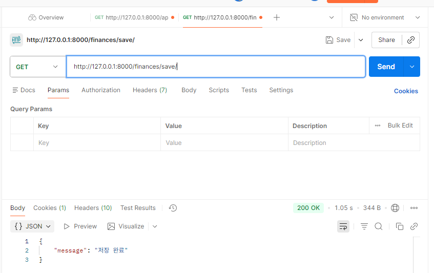
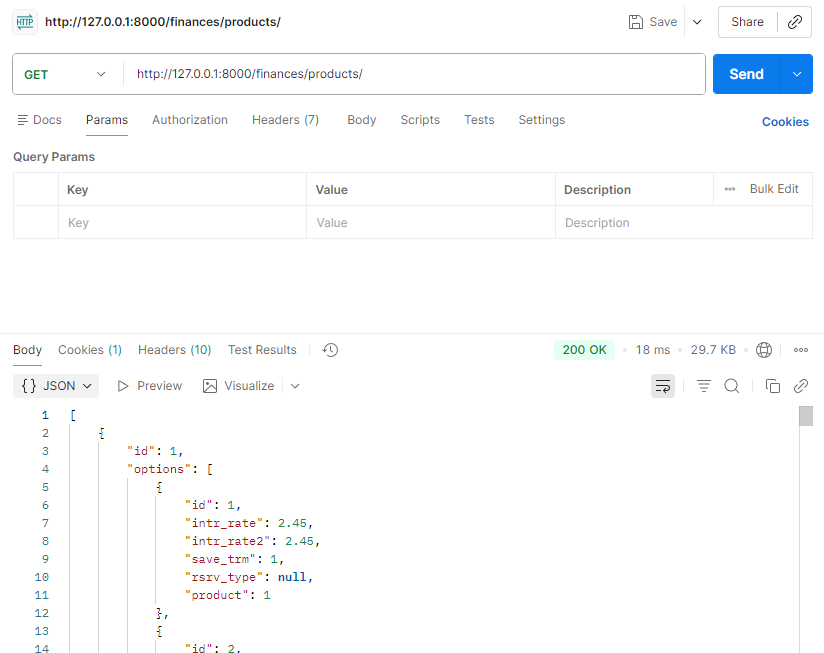
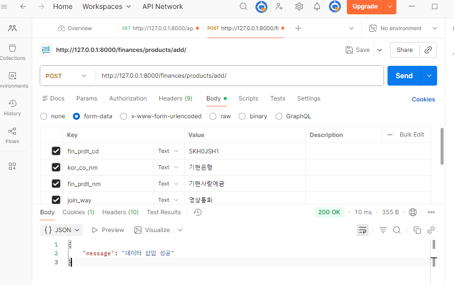
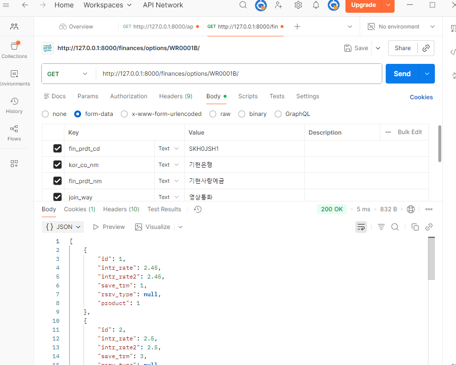
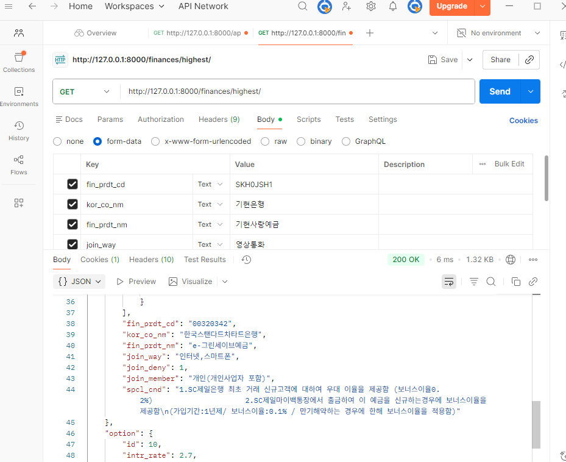

# 📘 07 관통 프로젝트 — 금융상품정보 REST API Server  
정기예금 상품 정보 수집·저장 및 조회 API 구축 프로젝트

---

## 📌 프로젝트 개요

본 프로젝트는 **금융상품통합비교공시(금융감독원) API의 정기예금 데이터를 활용하여**  
Django 기반 REST API 서버를 구축하는 것을 목표로 한다.

외부 API에서 제공하는 정기예금 상품 및 옵션 데이터를 DB에 저장하고,  
Django REST Framework를 이용하여 이를 JSON 형태로 제공하는 백엔드 시스템을 구현했다.

또한 Postman을 활용하여 전체 기능을 검증하고,  
API KEY는 `.env`와 django-environ을 통해 보안 관리하였다.

---

## 🏗️ 기술 스택

- Python 3  
- Django  
- Django REST Framework  
- SQLite3  
- Requests  
- django-environ  
- Postman  

---

# 📂 구현 기능 정리

아래는 명세서 기반 F01 ~ F05 기능 구현 결과이다.

---

## 🔥 F01 — 정기예금 상품 및 옵션 정보 DB 저장

금융감독원 정기예금 API를 호출하여 상품 목록(`baseList`)과 옵션(`optionList`)을 수집하고  
Django ORM을 이용해 DepositProducts, DepositOptions 모델에 저장하였다.

- API KEY는 `.env`로 관리
- `update_or_create()`로 중복 데이터 없이 저장
- 금융감독원 API의 누락 필드 발생(rsrv_type 등)을 예외 처리

📸 **실행 화면**  

---

## 🔥 F02 — 전체 정기예금 상품 JSON 반환

DB에 저장된 모든 정기예금 상품을 JSON 형태로 반환하는 REST API를 구현하였다.

- DepositProductsSerializer로 직렬화
- 옵션 정보는 nested serializer로 함께 포함

📸 **실행 화면**  

---

## 🔥 F03 — 정기예금 상품 직접 추가 (POST)

사용자가 직접 JSON 데이터를 POST 요청으로 입력하여 상품을 추가할 수 있게 구성하였다.

- POST 요청 처리
- validation 실패 시 오류 반환
- 성공 시 “데이터 삽입 성공” 메시지 제공

📸 **실행 화면**  

---

## 🔥 F04 — 특정 상품 옵션 리스트 조회

상품 코드(`fin_prdt_cd`)를 기준으로 해당 상품의 모든 옵션 정보를 조회하도록 구현했다.

- ForeignKey로 연결된 옵션 목록을 serializer로 반환
- 상품 미존재 시 404 처리

📸 **실행 화면**  

---

## 🔥 F05 — 최고 금리 상품 조회

전체 옵션 중 **intr_rate2(최고 우대금리)**가 가장 높은 옵션을 조회하고  
해당 옵션과 연관된 상품 정보를 함께 반환한다.

- ORM `order_by('-intr_rate2').first()` 활용
- 응답 구조: { 상품정보 + 옵션정보 }

📸 **실행 화면**  

---

# 📘 프로젝트 구조

project/
│ manage.py
│ .env
│ README.md
│ requirements.txt
│
├── finances/
│ ├── models.py
│ ├── serializers.py
│ ├── views.py
│ ├── urls.py
│ ├── utils.py
│ └── migrations/
│
├── pictures/
│ ├── 07_F01.png
│ ├── 07_F02.png
│ ├── 07_F03.png
│ ├── 07_F04.png
│ └── 07_F05.png
│
└── Finflow/
├── settings.py
├── urls.py
└── wsgi.py

---

# 📚 학습 내용 정리

### ✔ 외부 API 연동
- Requests 라이브러리로 금융감독원 API 호출
- 파라미터 전달 및 JSON 데이터 파싱
- API 응답 구조(result → baseList, optionList) 분석

### ✔ 환경 변수 관리
- `.env` 파일로 API KEY 보관
- django-environ으로 안전하게 settings.py에서 로드
- BASE_DIR 이후에 read_env() 사용해야 정상 로드됨

### ✔ Django ORM 활용
- `update_or_create()`를 통한 중복 방지
- FK 관계(product ↔ options) 매핑
- 일부 필드 누락(rsrv_type 등)으로 발생하는 IntegrityError 해결 경험

### ✔ Django REST Framework
- Serializer를 이용한 JSON 직렬화
- Nested Serializer 구성법 학습
- Response 객체를 통한 REST 응답 형식 구성

### ✔ RESTful API 설계 및 테스트
- `/save/`, `/products/`, `/products/add/`, `/options/<코드>/`, `/highest/` 엔드포인트 설계
- GET/POST 요청 처리 방식 이해
- Postman으로 전체 API 정상 검증

---

# 💡 느낀 점 / 회고

이번 프로젝트는 단순한 코드 작성이 아니라  
**외부 API → 데이터 가공 → DB 저장 → REST API 응답 → 테스트**  
까지 이어지는 백엔드 전체 사이클을 경험할 수 있는 실전 프로젝트였다.

특히 기억에 남는 점은:

- 환경변수 로딩 문제(API KEY 읽힘 실패)  
- 금융감독원 API의 옵션 데이터 누락으로 인한 IntegrityError  
- Nested Serializer 설계  
- Postman을 통한 오류 추적 및 해결 과정  

이 과정을 통해 **백엔드 API 설계 능력과 디버깅 능력이 크게 향상**되었다.

또한, JSON 기반 금융상품 데이터 구조를 분석하면서  
실제 실무에서 어떻게 외부 데이터가 들어오고 처리되는지 이해할 수 있었고,  
앞으로 금융 상품 추천 서비스나 AI 기반 금융 데이터 처리까지 확장할 수 있는 기틀이 마련되었다.

---